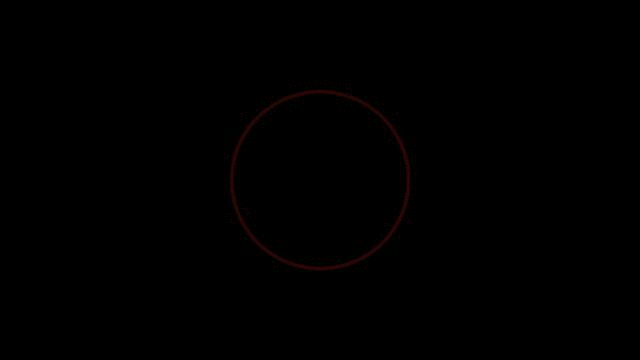

# The Circle Screensaver (for Windows)

This is a screensaver hack I created for my home desktop. I say hack because behind the scenes
it is just a bunch of JPG files with different color circles and I use the standard Windows
screensaver program to cycle through them. I like the peacefulness of it and the modern look
it gives my computer late at night.

This is what the screensaver looks like in action:

If you want to use this screensaver hack you should be able to use the circle_1920.gif file, although I haven't
tried it. What I did was put the 54 JPG image files in a directory and told Windows Screensaver to cycle
through all the files in the directory. Dusted and done.

I created the 54 JPG images files using a Python program that cycled through a hue range in 54 steps, drawing a
circle (using Pillow) on an Image object and saving it to disk - 54 times.
